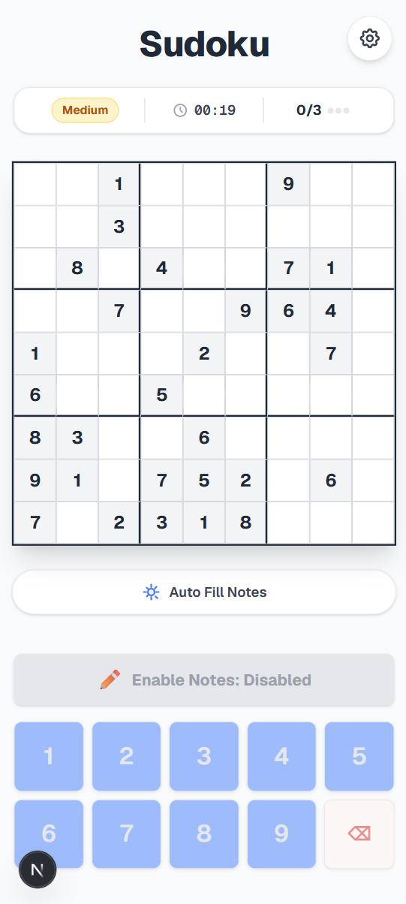

# Sudoku

My aim is to build a sudoku web app without any ads. It all started when I was playing on a mobile app and fell in love with the game. Problem was: too many ads! I tried different apps and ad free websites but none of them had my favorite feature: a button that automatically writes all the notes...

Example on mobile:



## Tech Stack

- **Framework**: Next.js & React
- **Language**: TypeScript
- **Styling**: Tailwind CSS
- **State Management**: Custom React Hooks

## API

I found online the [youdosudoku](https://www.youdosudoku.com/) API which is completely free and easy to use, it also allows you to choose the difficulty between easy, medium and hard.

Credits to the original creator of the API: [kevinstewartmercurio](https://www.kevinstewartmercurio.com/)

## Key Features

- **Dual Game Modes**:
  - **Assisted Mode**: Real-time error validation with immediate visual feedback
  - **Classic Mode**: Unassisted experience where players must rely on their own logic

- **QoL Mechanics**:
  - **Smart Notes** (Pencil Marks): Fully functional 3x3 mini-grid within empty cells to track possible numbers.
  - **Auto-fill Notes**: A time-saving algorithm that calculates and populates all valid possibilities for the remaining empty cells.
  - **Dynamic Highlighting**: Clicking a cell automatically highlights all identical numbers across the board, as well as its corresponding "peers" (row, column, 3x3 quadrant)

- **Fully Responsive UI:** The grid and surrounding layout were implemented with a mobile-first approach, utilizing CSS Grid and dynamic max-widths to ensure a perfect aspect ratio on any device.

## Architecture & Design Decisions

### 1. Zero-Latency Client-Side Engine
To guarantee immediate tactical feedback (under 16ms per interaction), the core game engine is entirely decoupled from the server once the initial puzzle is fetched. All move validations, note filtering, and win-state calculations are processed locally on the client using a centralized custom hook (`useSudoku`).

### 2. Centralized State Management over Global Stores
For an application of this scope, relying on external state management libraries like Redux would introduce unnecessary boilerplate. Instead, the application relies on native React state colocation. The overarching `GameState` is hoisted to the highest level component (`page.tsx`), passing down necessary props and callbacks. This keeps individual components (like `Board` and `Cell`) pure, functional, and completely unaware of the global context.

### 3. Derived State for UI Rendering
Instead of cluttering the React state with active UI properties (e.g., "is this cell currently highlighted?"), visual cues are calculated dynamically during the render phase. For example, the `Board` component calculates mathematical relations on the fly (`Math.floor(rowIndex / 3) === Math.floor(selectedCell.row / 3)`) to instantly determine if a cell belongs to the active 3x3 quadrant, passing a simple boolean to the child component.

### 4. Conflict-Free Tailwind Styling
The `Cell` component utilizes a strict JavaScript-based priority system for applying CSS classes (e.g., *Error > Selected > Highlighted Value > Peer > Fixed*). This prevents Tailwind class collisions and ensures the UI always communicates the most critical game state to the player without ever relying on `!important` CSS overrides.

## Future Development

The current version provides a polished single-player frontend experience, but the architecture was designed with future scaling in mind. Upcoming developments include:

- **Backend Infrastructure**: Transitioning to a Full Stack architecture using Next.js Route Handlers to validate puzzle solutions securely on the server.

- **Database Integration**: Connecting Convex and Clerk to have a quick database and an authentication service setup used to store user accounts, match histories, and implement global leaderboards for fastest completion times.

- **Progressive Web App**: Enhancing the application to be installable on mobile devices with offline capabilities, allowing players to solve Sudoku on airplanes or commutes without an internet connection.

## Play locally on PC

As of the current state of the application it can only be run locally on the dev server.

To run this project locally on your machine and test the code, ensure you have [Node.js](https://nodejs.org/) installed, then follow these steps:

1. Clone the repository 

``` bash
git clone https://github.com/Ludovico02/sudoku.git
```

2. Navigate to the directory

``` bash
cd sudoku
```

3. Install the dependencies

``` bash
npm install
```

4. Run the development server

``` bash
npm run dev
```

5. Play the game on

[http://localhost:3000](http://localhost:3000)
